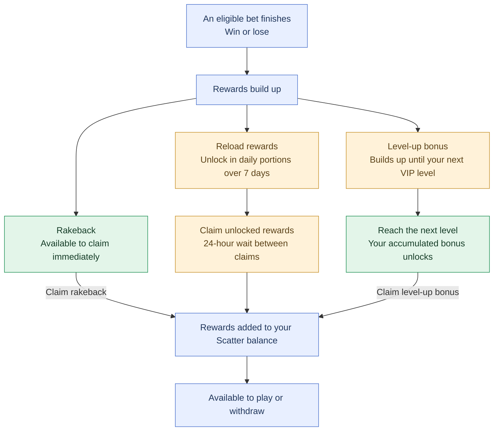

Scatter operates a transparent bonusing system. All rewards are calculated automatically from onchain activity and credited without manual review, wagering requirements, or expiry. There are no sticky bonuses, opaque promotions, or comp negotiations.

The system has four components: rakeback, reload, level-up, and [referral](/protocol/referrals).

Scatter rewards eligible play with **15% rakeback, 10% toward your next level-up reward, and 40% in reload rewards**. These percentages are based on the expected house earnings from your bets—not your total wager or actual losses. Rakeback builds as you play, and your accumulated level-up reward unlocks when you reach the next VIP level. Reload rewards unlock over seven days, with **15%, 10%, 5%, 4%, 3%, 2%, and 1%** becoming available on successive days. Rewards are earned in the currency you play with: USDC or SHFL. If you refer other players, you can also earn affiliate rewards, with tier rates ranging from **10% to 15%** based on referred wagering.

Your reward percentages stay the same from **Starter through Scattered (levels 0–9)**, with each new level unlocking your accumulated level-up reward. When you reach **Mythic (level 10)**, your 10% level-up allocation automatically becomes additional rakeback, increasing your rakeback to **25%** from your next bet. Reload rewards remain at **40%**, keeping your combined reward allocation at **65%** on reload-eligible play.

## Rakeback

Rakeback returns a portion of every bet placed back to the player as Cash. The amount is calculated from total wager volume and is credited as soon as the rakeback balance >0.01 USD

Key properties:

- Calculated from gross wager volume, not from net losses
- Paid in Cash or SHFL with no wagering requirement
- No expiry
- Rate scales with the player's current level (see Level-up)

## Reload Vault

Reload pays a decaying share of a player's accrued edge over 7 days. The schedule starts at 15% on day 0 and decays to 1% on day 6, totalling 40% of accrued edge across the week. Reloads never expire and can be claimed once a day.

| Day | % of Accrued Edge | Example (\$1,000 accrued edge) |
| --- | --- | --- |
| 0 | 15% | \$150 |
| 1 | 10% | \$100 |
| 2 | 5% | \$50 |
| 3 | 4% | \$40 |
| 4 | 3% | \$30 |
| 5 | 2% | \$20 |
| 6 | 1% | \$10 |
| Total | 40% | \$400 |

## Level-up

Level-up is Scatter's player progression system. Every bet contributes to lifetime wager volume, which determines the player's current level. Crossing each level threshold pays out a bonus equal to 10% of the edge generated on the wager volume since the previous level.

Mythic grants a permanent +10% boost to the player's rakeback rate in lieu of a one-time bonus.

Levels are deterministic and based purely on edge generated. There is no application process, no host relationship, and no discretionary upgrades.

