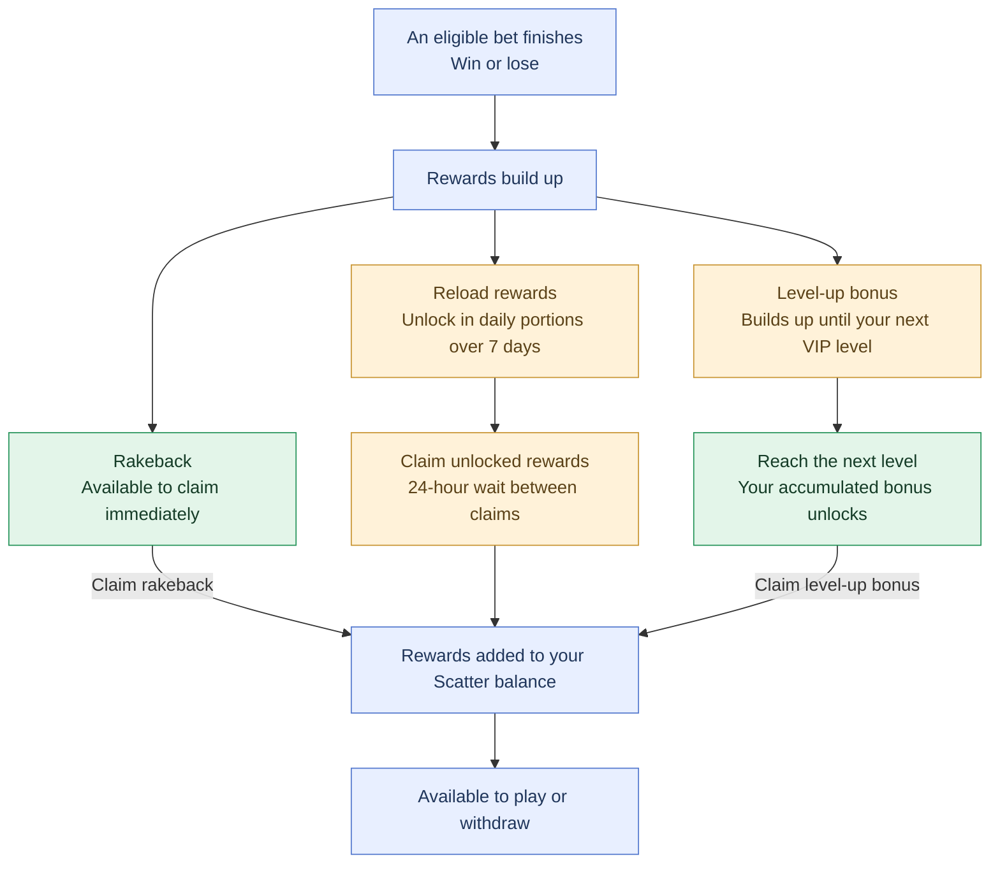

Scatter operates a transparent bonusing system. All rewards are calculated automatically from onchain activity and credited without manual review, wagering requirements, or expiry. There are no sticky bonuses, opaque promotions, or comp negotiations.

The system has four components: rakeback, reload, level-up, and [referral](/protocol/referrals).

Scatter rewards eligible play with **15% rakeback, 10% toward your next level-up reward, and 40% in reload rewards**. Rakeback builds as you play, and your accumulated level-up reward unlocks when you reach the next VIP level. Reload rewards unlock over seven days, with **15%, 10%, 5%, 4%, 3%, 2%, and 1%** becoming available on successive days. Rewards are earned in the currency you play with: USDC or SHFL. If you refer other players, you can also earn affiliate rewards, with tier rates ranging from **10% to 15%** based on referred wagering.

Your reward percentages stay the same from **Starter through Scattered (levels 0–9)**, with each new level unlocking your accumulated level-up reward. When you reach **Mythic (level 10)**, your 10% level-up allocation automatically becomes additional rakeback, increasing your rakeback to **25%** from your next bet. Reload rewards remain at **40%**, keeping your combined reward allocation at **65%** on reload-eligible play. All rewards never expire, and are paid out onchain.

## Rakeback

Rakeback returns a share of the house edge generated by eligible bets.

You earn **15% of the house edge generated by eligible bets as rakeback** from Starter through Scattered. At Mythic, this increases to **25%**, starting with your next bet after reaching the level.

Rakeback accumulates as you play. Claim it to add it to your Scatter balance, subject to the minimum claim amount. Rewards are paid in the currency you played with—USDC or SHFL—with no wagering requirements or expiry.

For a simple bet, generated edge is your wager multiplied by the game's house-edge percentage. For example, an eligible 100 USDC bet at a 1% house edge generates 1 USDC of edge, whether you win or lose. That earns 0.15 USDC in rakeback, or 0.25 USDC at Mythic.

## Reload Vault

Reload rewards return **40% of the house edge generated by reload-eligible bets**, unlocking over seven days according to the schedule below.

Each claim collects all your unlocked, unclaimed reload rewards and adds them to your Scatter balance, subject to the minimum claim amount. After a successful claim, you must wait **24 hours** before claiming reload rewards again.

Rewards continue unlocking during that wait. Unclaimed rewards never expire, so missing a day does not mean losing them.

| Day | % of Accrued Edge | Example (\$1,000 accrued edge) |
| --- | --- | --- |
| 0 | 15% | \$150 |
| 1 | 10% | \$100 |
| 2 | 5% | \$50 |
| 3 | 4% | \$40 |
| 4 | 3% | \$30 |
| 5 | 2% | \$20 |
| 6 | 1% | \$10 |
| Total | 40% | \$400 |

## Level-up

Your VIP level progresses based on your lifetime eligible wager volume, measured in USD. Only bets that qualify for rewards contribute to level progress.

Before Mythic, **10% of the house edge generated by eligible bets** accumulates toward your next level-up reward. Reaching the next VIP level unlocks that reward. Claim it to add it to your Scatter balance, subject to the minimum claim amount.

When you reach **Mythic (level 10)**, your accumulated level-up reward unlocks. From your next bet, the 10% allocation becomes additional rakeback, increasing your rakeback rate from **15% to 25%**.

Progression follows defined wagering thresholds, with no application process or discretionary upgrades.

