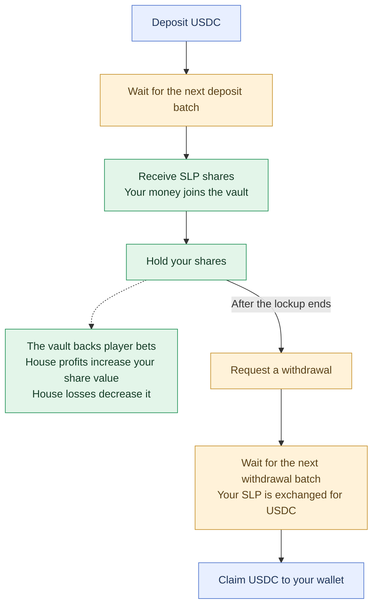

The Scatter Bankroll Vault is the community-owned bankroll for Scatter. Anyone can deposit Cash into the vault to take the opposite side of every bet placed on the platform. There is no separate house. The vault is the house.

### SLP Token

When you deposit Cash into the vault, you receive SLP, a standard SPL token representing your proportional share of the vault. SLP can be held in any Solana wallet, transferred, or used in other Solana protocols that support it.

SLP is not a rebasing token. Your balance does not change. The exchange rate between SLP and Cash adjusts continuously based on the vault's net position.

### Economic mechanics

The vault is the counterparty to every bet on Scatter. When players lose, vault value increases. When players win, vault value decreases. Over time, vault returns converge toward the house edge across all bets on the platform.

Of each bet's theoretical revenue, 10% is routed to the vault as a reward.

All depositors are equal. There are no preferred tranches, lockup tiers, or special terms.

### Depositing

1. Open the vault on Scatter and enter the amount of USDC to deposit.
2. Confirm your deposit request.
3. Your deposit joins an open epoch. When the epoch finalizes, it is converted into SLP at the epoch’s finalized exchange rate.
4. Your SLP remains locked until the deposit lockup ends. It then becomes eligible for a withdrawal request.

The lockup starts when the epoch finalizes. Your final SLP amount may differ from the estimate shown when submitting your request. Check the app for current epoch timing and lockup duration.

### Epochs

Scatter processes SLP deposits and withdrawals in batches called **epochs**. While an epoch is open, your request joins the batch. After the scheduled window ends and the required game settlements complete, the epoch closes and fixes the pricing used to convert between USDC and SLP. The batch is then finalized and the next epoch opens. Your final amount may differ from the estimate shown when you submitted your request, and processing may continue after the countdown reaches zero. Submitted requests cannot be cancelled.

For deposits, newly minted SLP enters a **deposit lockup that starts when the epoch finalizes**. Once the lockup ends, that SLP becomes eligible for a withdrawal request, which is processed in an open epoch. Adding a later deposit can extend the hold on SLP that is still locked if the balances are combined. Withdrawals have no additional deposit lockup: after their epoch finalizes and collection completes, the USDC proceeds appear in your Scatter balance. Check the app for current epoch timing and lockup information.

### Withdrawing

Once your deposit lockup ends, you can request a withdrawal using your available SLP.

Your request joins an open epoch. When that epoch finalizes, the requested SLP is burned and converted to USDC at the epoch's finalized exchange rate. After processing and collection complete, the USDC appears in your Scatter balance.

Withdrawals are processed in batches rather than instantly. Timing depends on epoch finalization and required settlements, and processing can be delayed while the vault is halted. There is no additional deposit lockup on withdrawals.

### Risk

[The vault absorbs the variance](/protocol/risks/bankroll-risk) of every bet on Scatter. Short-term PnL can be negative when players hit streaks. Over time, vault PnL is expected to track the house edge across all games, but returns are not guaranteed.

<Warning>
  SLP can decline in value, and vault returns are not guaranteed. Depositors should understand bankroll risk before depositing.
</Warning>

### Transparency

- Vault TVL and current SLP exchange rate: viewable in the Scatter app
- Per-game GGR and house edge: shown in the app, with full breakdowns per game
- All bets settled against the vault: visible onchain

### Withdrawing SLP to use in decentralized finance

SLP is not currently able to be transferred from the embedded wallet. We intend to make SLP transferrable in a future update.

---
