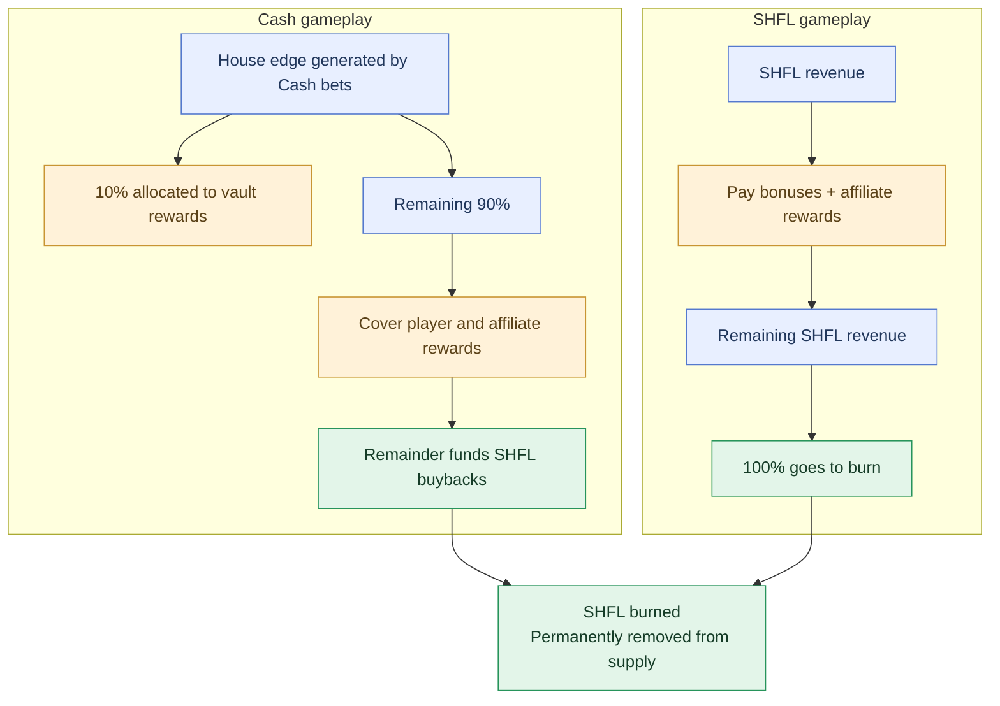

A portion of the house edge generated by Cash bets funds purchases of SHFL on the open market. The acquired SHFL is burned.

### Funding source

For Cash bets, allocations are calculated from the bet amount multiplied by the game's house edge. Of that amount, 10% is allocated to [Scatter Bankroll Vault](/protocol/scatter-bankroll-vault) rewards. The remaining 90% covers player and affiliate rewards, with the remainder funding SHFL buybacks and burns.

This buyback is enforced at the smart contract level on every bet and cannot be altered.

### Buyback execution

The buyback runs continuously and entirely on-chain:

1. Buyback-allocated revenue accumulates in a treasury account, denominated in USDC.
2. When the accumulator crosses a configurable threshold, a permissionless crank triggers a buyback.
3. The buyback executes against the SHFL/USDC pool on Solana mainnet
4. Execution is conditional on a TWAP check to ensure efficient pricing.
5. The acquired SHFL is burned via `spl_token::burn`.

Anyone can trigger the crank. There is no privileged operator and no manual intervention.

### Verification

Every buyback transaction is on-chain and independently verifiable.

- Treasury balance is viewable on Solscan.
- Buyback transactions appear in the DEX program logs.
- Burns appear as SPL token supply changes on-chain.

## SHFL Wagering

SHFL is a wager asset on Scatter. Bets with SHFL do not interact with the Bankroll Vault and instead are wagered against Scatter's SHFL treasury. All revenue derived from SHFL wagering is burnt on a monthly basis by the protocol. 

